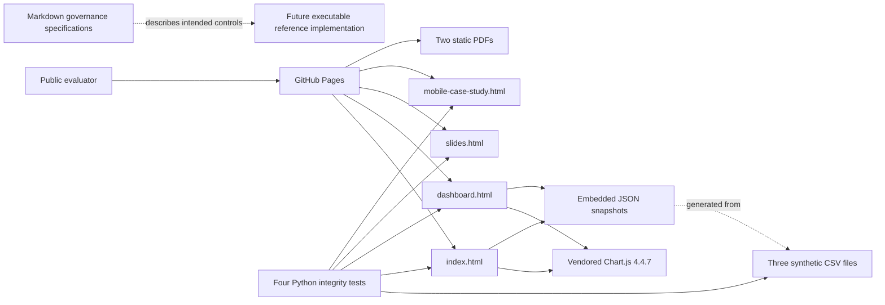
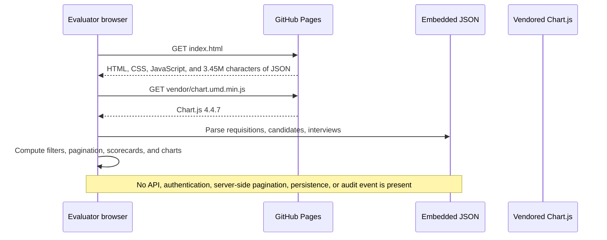

# Current Architecture Map

## Executable topology

`index.html` and `dashboard.html` are identical static applications. They do not fetch the CSV files at runtime; each contains a separate embedded copy of all three datasets.

## Browser data flow

## Trust boundaries

| Boundary | Current reality | Consequence |
|---|---|---|
| Public Internet → GitHub Pages | Every tracked web/data asset is public | The data must remain synthetic and publishable |
| GitHub Pages → browser | Static files only; GitHub supplies transport | The application cannot enforce user identity or role permissions |
| Browser UI → embedded data | The browser receives the entire dataset | UI filtering is not data-access control |
| Governance documents → executable behavior | Documentation is not connected to runtime policy | RBAC, audit, retention, erasure, and workflow claims remain design intent |
| Source CSV → embedded JSON | Two manually duplicated snapshots | Drift is possible without generation/parity automation |

## Current security model

The current model is publish-only: minimize the repository to synthetic data, avoid secrets and local paths, pin the one client dependency, and keep the application non-transactional. There are no privileged runtime operations to protect, but there is also no basis for claiming authenticated or role-scoped behavior.

## Target direction (not implemented)

A later vertical slice can introduce a relational schema, versioned workflow service, role-scoped API, append-only audit events, and a thin UI consuming field-projected endpoints. That target must preserve the present governed KPIs and synthetic-data boundary without pretending to be a production ATS.
